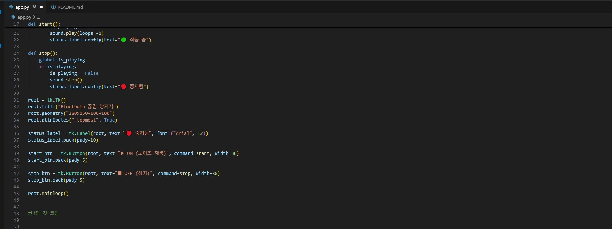
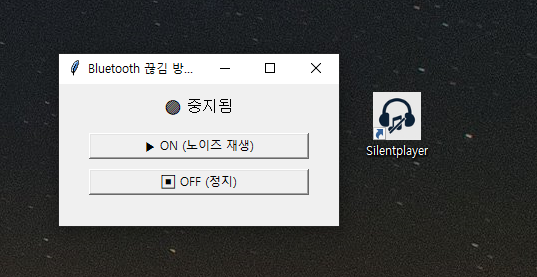

# 🔊 SilentPlayer - 블루투스 스피커 끊김 방지용 초저볼륨 소리 출력 도구

## 📌 프로젝트 개요

조용한 환경에서 블루투스 스피커를 사용할 때, 일정 시간 동안 출력되는 소리가 없으면
스피커가 절전 모드로 진입하거나 강제로 연결이 끊기는 문제가 반복적으로 발생하였습니다.

본 프로젝트는 해당 문제를 해결하기 위한 개인적인 목적에서 출발하였으며,
**시스템에만 감지되는 소리를 지속적으로 출력**함으로써 연결 유지를 가능하게 하는 유틸리티입니다.

코딩 입문자이기 떄문에 최대한 챗지피티를 활용 했습니다!

---

## 🧠 실험 배경 및 동기

처음에는 "사운드가 없더라도 연결을 유지할 수 있지 않을까?"라는 가정하에
완전 무음(`VOLUME = 0`)을 재생해보았지만, 시스템에서 이를 인식하지 못했고 블루투스 연결이 해제되었습니다.

이후 극저볼륨 화이트노이즈를 사용하여 **사람의 귀에는 거의 들리지 않지만**
시스템에서는 출력으로 인식할 수 있는 임계값을 직접 탐색하였습니다.

---

## ⚠️ 실제 개발 과정 중 발생한 주요 문제들

### 📌 문제 1: PyInstaller 실행 실패 - "app.py does not exist"

개발 초기, 바탕화면에서 바로 `pyinstaller` 명령어를 실행했으나
스크립트를 찾을 수 없다는 오류가 발생했습니다.


> 📌 원인: 현재 디렉토리가 `app.py`가 위치한 경로가 아니었음  
> ✅ 해결: 주소창에서 전체 경로 복사 후 `cd /d "경로"`로 이동한 뒤 재실행

---

### 📌 문제 2: 아이콘 적용 실패 - 확장자만 `.ico`로 변경

디자인한 아이콘을 `.png`에서 단순히 확장자만 `.ico`로 변경하여 사용하려 했으나
Windows에서 인식되지 않았고, 속성에서 아이콘 변경 시 무반응 현상이 발생하였습니다.

>


> 📌 원인: 파일 포맷은 여전히 PNG였음  
> ✅ 해결: Python의 Pillow를 사용해 `.ico` 포맷으로 정확히 변환

---

### 📌 문제 3: 무음 출력 실패 - 시스템 인식 불가

화이트노이즈 대신 무음을 시도했을 때, 시스템에서는 출력으로 감지하지 못해
블루투스 스피커가 여전히 절전 모드로 진입했습니다.

```python
VOLUME = 0.0
```

> ✅ 이후 0.00001부터 직접 볼륨을 조절하며 실험한 결과,  
> 🎯 **시스템이 감지하고, 귀에는 거의 안 들리는 최적 값은 `0.00028`**이었습니다.

---

## 🖥️ 기념 스크린샷

아래는 최종적으로 완성된 `app.py`의 GUI 실행 화면 및 코드 구조입니다.





---

## 🛠 기술 스택

- Python 3.13
- tkinter (GUI 구성)
- pygame (오디오 출력)
- numpy (노이즈 생성)
- pyinstaller (배포용 실행파일 제작)
- pillow (아이콘 포맷 변환)

---

## 📂 프로젝트 구조

```
SilentPlayer
├─ app.py
├─ silent_icon.ico
├─ README.md
├─ dist/
│  └─ app.exe
├─ screenshots/
│  ├─ error_no_app_py.png
│  ├─ invalid_icon.png
│  └─ image.png
```

---

## 🎮 실행 방법

### 방법 1. 개발 환경에서 실행

```bash
pip install pygame numpy
python app.py
```

### 방법 2. 배포 버전 실행파일 사용

- PyInstaller로 빌드된 `.exe`는 `/dist` 폴더 내에 존재
- 바탕화면에 바로가기 등록 후 아이콘 커스터마이징 가능

---

## 📅 개발 기록

| 날짜         | 주요 작업 내용 |
|--------------|----------------|
| 2025-04-13   | GUI 제작 및 사운드 시스템 설계 |
| 2025-04-13   | 실험을 통한 최적 볼륨 도출 (`0.00028`) |
| 2025-04-13   | `.exe` 빌드 및 오류 해결, 아이콘 적용 완료 |

---

## 📌 추후 개선 계획

- 시작 프로그램 등록 자동화
- 트레이 모드 최소화 기능
- 로고 삽입 및 어두운 테마 GUI 디자인 적용
-과한 
- 과한 소요시간 (무려 5시간 깃허브, 용어미숙지 등등) 단축하기